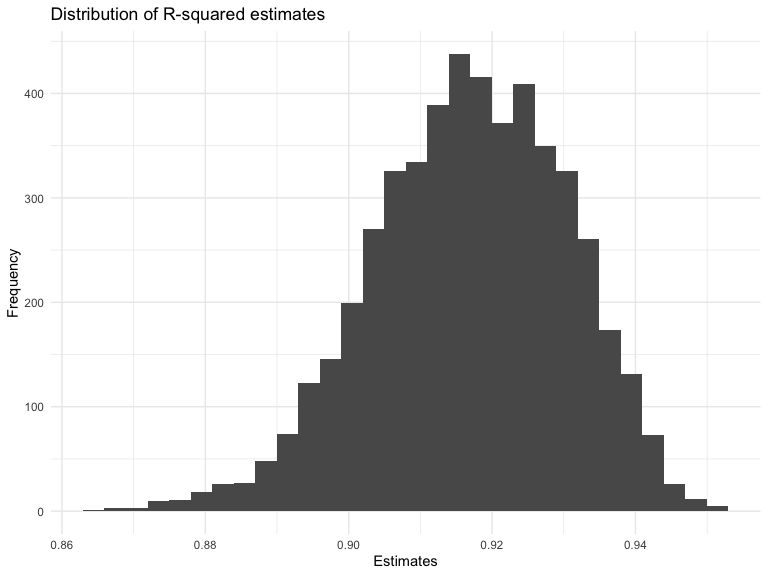
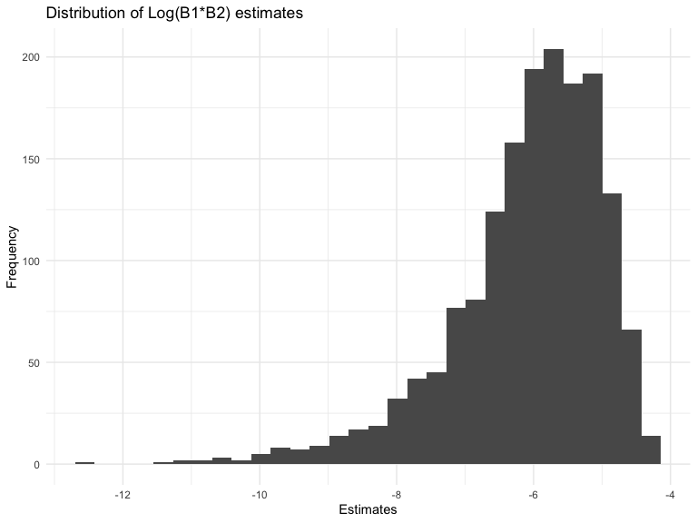
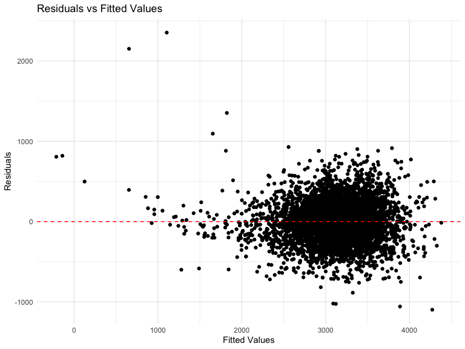
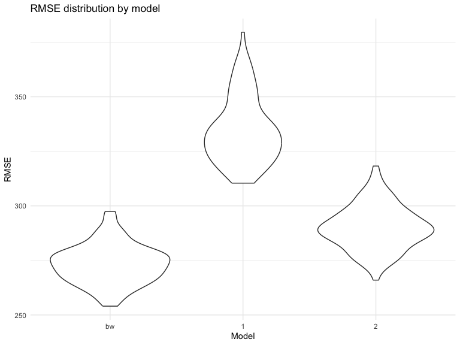

p8105_hw6_crd2162
================
Caleigh Dwyer
2023-11-28

### Problem 1: Homicide Data

In the data cleaning code below we create a `city_state` variable,
change `victim_age` to numeric, modifiy victim_race to have categories
white and non-white, with white as the reference category, and create a
`resolution` variable indicating whether the homicide is solved. Lastly,
we filtered out the following cities: Tulsa, AL; Dallas, TX; Phoenix,
AZ; and Kansas City, MO; and we retained only the variables
`city_state`, `resolution`, `victim_age`, `victim_sex`, and
`victim_race`.

``` r
homicide_df = 
  read_csv("data/homicide-data.csv", na = c("", "NA", "Unknown")) |> 
  mutate(
    city_state = str_c(city, state, sep = ", "),
    victim_age = as.numeric(victim_age),
    resolution = case_when(
      disposition == "Closed without arrest" ~ 0,
      disposition == "Open/No arrest"        ~ 0,
      disposition == "Closed by arrest"      ~ 1)
  ) |> 
  filter(victim_race %in% c("White", "Black")) |> 
  filter(!(city_state %in% c("Tulsa, AL", "Dallas, TX", "Phoenix, AZ", "Kansas City, MO"))) |> 
  select(city_state, resolution, victim_age, victim_sex, victim_race)
```

    ## Rows: 52179 Columns: 12
    ## ── Column specification ────────────────────────────────────────────────────────
    ## Delimiter: ","
    ## chr (8): uid, victim_last, victim_first, victim_race, victim_sex, city, stat...
    ## dbl (4): reported_date, victim_age, lat, lon
    ## 
    ## ℹ Use `spec()` to retrieve the full column specification for this data.
    ## ℹ Specify the column types or set `show_col_types = FALSE` to quiet this message.

Next we fit a logistic regression model using only data from Baltimore,
MD. We model `resolved` as the outcome and `victim_age`, `victim_sex`,
and `victim_race` as predictors. We save the output as `baltimore_glm`
so that we can apply `broom::tidy` to this object and obtain the
estimate and confidence interval of the adjusted odds ratio for solving
homicides comparing non-white victims to white victims.

``` r
baltimore_glm = 
  filter(homicide_df, city_state == "Baltimore, MD") |> 
  glm(resolution ~ victim_age + victim_sex + victim_race, family = binomial(), data = _)

baltimore_glm |> 
  broom::tidy() |> 
  mutate(
    OR = exp(estimate), 
    OR_CI_upper = exp(estimate + 1.96 * std.error),
    OR_CI_lower = exp(estimate - 1.96 * std.error)) |> 
  filter(term == "victim_sexMale") |> 
  select(OR, OR_CI_lower, OR_CI_upper) |>
  knitr::kable(digits = 3)
```

|    OR | OR_CI_lower | OR_CI_upper |
|------:|------------:|------------:|
| 0.426 |       0.325 |       0.558 |

Below, by incorporating `nest()`, `map()`, and `unnest()` into the
preceding Baltimore-specific code, we fit a model for each of the
cities, and extract the adjusted odds ratio (and CI) for solving
homicides comparing non-white victims to white victims. We show the
first 5 rows of the resulting dataframe of model results.

``` r
model_results = 
  homicide_df |> 
  nest(data = -city_state) |> 
  mutate(
    models = map(data, \(df) glm(resolution ~ victim_age + victim_sex + victim_race, 
                             family = binomial(), data = df)),
    tidy_models = map(models, broom::tidy)) |> 
  select(-models, -data) |> 
  unnest(cols = tidy_models) |> 
  mutate(
    OR = exp(estimate), 
    OR_CI_upper = exp(estimate + 1.96 * std.error),
    OR_CI_lower = exp(estimate - 1.96 * std.error)) |> 
  filter(term == "victim_sexMale") |> 
  select(city_state, OR, OR_CI_lower, OR_CI_upper)

model_results |>
  slice(1:5) |> 
  knitr::kable(digits = 3)
```

| city_state      |    OR | OR_CI_lower | OR_CI_upper |
|:----------------|------:|------------:|------------:|
| Albuquerque, NM | 1.767 |       0.831 |       3.761 |
| Atlanta, GA     | 1.000 |       0.684 |       1.463 |
| Baltimore, MD   | 0.426 |       0.325 |       0.558 |
| Baton Rouge, LA | 0.381 |       0.209 |       0.695 |
| Birmingham, AL  | 0.870 |       0.574 |       1.318 |

Below we generate a plot of the estimated ORs and CIs for each city,
ordered by magnitude of the OR from smallest to largest. From this plot
we see that most cities have odds ratios that are smaller than 1,
suggesting that crimes with male victims have smaller odds of resolution
compared to crimes with female victims after adjusting for victim age
and race. This disparity is strongest in New York. In roughly half of
these cities, confidence intervals are narrow and do not contain 1,
suggesting a significant difference in resolution rates by sex after
adjustment for victim age and race.

``` r
model_results |> 
  mutate(city_state = fct_reorder(city_state, OR)) |> 
  ggplot(aes(x = city_state, y = OR)) + 
  geom_point() + 
  geom_errorbar(aes(ymin = OR_CI_lower, ymax = OR_CI_upper)) + 
  theme(axis.text.x = element_text(angle = 90, hjust = 1))
```


## Problem 2: Weather Data

The following chunk imports weather data from NOAA

``` r
weather_df = 
  rnoaa::meteo_pull_monitors(
    c("USW00094728"),
    var = c("PRCP", "TMIN", "TMAX"), 
    date_min = "2022-01-01",
    date_max = "2022-12-31") |>
  mutate(
    name = recode(id, USW00094728 = "CentralPark_NY"),
    tmin = tmin / 10,
    tmax = tmax / 10) |>
  select(name, id, everything())
```

    ## using cached file: /Users/caleighdwyer/Library/Caches/org.R-project.R/R/rnoaa/noaa_ghcnd/USW00094728.dly

    ## date created (size, mb): 2023-09-28 10:20:17.291852 (8.524)

    ## file min/max dates: 1869-01-01 / 2023-09-30

Let’s create a linear model for maximum temperature (`tmax`) with
minimum temperature (`tmin`) and precipitation levels (`prcp`) as
predictors.

``` r
lm_weather =
  weather_df |> 
  lm(tmax ~ tmin + prcp, data = _)
```

Then, we’ll find the r squared and log(b1\*b2) for the weather model.
Note that because the coefficient for prcp is negative, the log of the
product of coefficients produces an NA. The log estimates are then
merged with the r.squared data.

``` r
lm_weather_rsq=
lm_weather |>
  broom::glance() |> 
  select(r.squared)

lm_weather_est=
  lm_weather |> 
  broom::tidy() |> 
  select(term, estimate) |> 
  filter(term != "(Intercept)") |> 
  summarize(log_coef = log(estimate[term == "tmin"] * estimate[term== "prcp"]))


weather_results=
bind_cols(lm_weather_rsq, lm_weather_est)
```

Now let’s create 5000 bootstrap samples. We’ll use map to write linear
models for each bootstrap sample and produce r-squared and coefficients
for each model. This produces a dataframe containing a dataframe for
each bootstrap sample, a dataframe of models for each sample, a
dataframe containing the r-squared, and a dataframe containing the
estimates. We’ll then unnest the estimate dataframe to calculate the log
of the product of coefficients for each model. We’ll then merge these
datasets.

``` r
bootstrap_results=
  weather_df |> 
  modelr::bootstrap(n = 5000) |> 
  mutate(
    models = map(strap, \(df) lm(tmax ~ tmin + prcp, data = df)),
    rsqr = map(models, broom::glance),
    est = map (models, broom::tidy)
  )
 
log_coef =
bootstrap_results |> 
 unnest(est) |> 
  summarize(log_coef = log(estimate[term == "tmin"] * estimate[term== "prcp"]))
  
bootstrap_df=
  bind_cols(bootstrap_results, log_coef) |> 
  unnest(rsqr) |> 
  select(strap, .id, models, r.squared, est, log_coef)
```

As mentioned, any model that includes a negative coefficient for prcp or
tmin will yield a “NaN” result when calculating the log of the product
of coefficients. The chunk below calculates how many bootstrap samples
produced NaN log estimates for this reason. Out of 5000 bootstrap
samples, an astonishing 3361 samples produced NaN log estimates.

``` r
bootstrap_df |> 
  filter(log_coef == "NaN") |> 
  count(log_coef)
```

    ## # A tibble: 1 × 2
    ##   log_coef     n
    ##      <dbl> <int>
    ## 1      NaN  3361

I will now plot the distribution of r squared estimates for the
bootstrap samples. The distribution of r squared estimates shows that
most estimates are centered around 0.92. The distribution is slightly
left skewed.

``` r
bootstrap_df |> 
  ggplot(aes(x = r.squared))+
  geom_histogram()+
  labs(
    title = "Distribution of R-squared estimates",
    x = "Estimates",
    y = "Frequency"
  )
```

    ## `stat_bin()` using `bins = 30`. Pick better value with `binwidth`.



Here is a distribution of the valid log estimates for the bootstrap
samples. The distribution of log estimates shows that most estimates are
centered around -6. The distribution of log estimates is left skewed as
well, with a greater skew than the r squared estimates.

``` r
bootstrap_df |> 
  filter(log_coef != "NaN") |> 
  ggplot(aes(x = log_coef))+
  geom_histogram()+
  labs(
    title = "Distribution of Log(B1*B2) estimates",
    x = "Estimates",
    y = "Frequency"
  )
```

    ## `stat_bin()` using `bins = 30`. Pick better value with `binwidth`.



Now we’ll find the confidence interval for each estimate using the
bootstrap samples:

``` r
CI_rsqr = 
  bootstrap_df |> 
  summarize(
    lower_bound = quantile(r.squared, 0.025),
    upper_bound = quantile(r.squared, 0.975)) |> 
  print()
```

    ## # A tibble: 1 × 2
    ##   lower_bound upper_bound
    ##         <dbl>       <dbl>
    ## 1       0.889       0.941

``` r
CI_logcoef =
  bootstrap_df |> 
  filter(log_coef != "NaN") |> 
  summarize(
    lower_bound = quantile(log_coef, 0.025),
    upper_bound = quantile(log_coef, 0.975)) |> 
  print()
```

    ## # A tibble: 1 × 2
    ##   lower_bound upper_bound
    ##         <dbl>       <dbl>
    ## 1       -8.98       -4.60

## Problem 3: Birthweight data

First, we’ll import the birthweight data:

``` r
bw_raw = 
  read_csv("data/birthweight.csv")
```

    ## Rows: 4342 Columns: 20
    ## ── Column specification ────────────────────────────────────────────────────────
    ## Delimiter: ","
    ## dbl (20): babysex, bhead, blength, bwt, delwt, fincome, frace, gaweeks, malf...
    ## 
    ## ℹ Use `spec()` to retrieve the full column specification for this data.
    ## ℹ Specify the column types or set `show_col_types = FALSE` to quiet this message.

Then, we’ll tidy the data. The following data will be recoded to use
actual values rather than dummy values: babysex, frace, malform, and
mrace.

``` r
bw_df = 
  bw_raw |> 
  mutate(
    babysex =
      recode(
        babysex,
        "1" = "male",
        "2" = "female"
      ),
    frace = 
      recode(
        frace,
        "1" = "white",
        "2" = "black",
        "3" = "asian",
        "4" = "puerto rican",
        "8" = "other",
        "9" = "unknown"
      ),
  malform =
    recode(
      malform,
      "0" = "absent",
      "1" = "present"
    ),
  mrace=
    recode(
      mrace,
      "1" = "white",
      "2" = "black",
      "3" = "asian",
      "4" = "puerto rican",
      "8" = "other",
      "9" = "unknown"
    )
  ) |> 
  filter(frace != "unknown", mrace!= "unknown")
```

I will now use stepwise model building to construct a model that
predicts birthweight. I first create an input model 0 that includes all
the variables in our data set as predictors of bwt. Then, I’ll use the
step function to conduct the stepwise modeling. Then, I select the model
with the lowest AIC from the stepwise output and name it bw_step.

``` r
model_0=
  bw_df |> 
  lm(bwt ~ babysex + bhead + blength + delwt + fincome + frace + gaweeks + malform + menarche + mheight + momage + mrace + parity + pnumlbw + pnumsga + ppbmi + ppwt + smoken + wtgain, data = _) |> 
  step()
```

    ## Start:  AIC=48717.83
    ## bwt ~ babysex + bhead + blength + delwt + fincome + frace + gaweeks + 
    ##     malform + menarche + mheight + momage + mrace + parity + 
    ##     pnumlbw + pnumsga + ppbmi + ppwt + smoken + wtgain
    ## 
    ## 
    ## Step:  AIC=48717.83
    ## bwt ~ babysex + bhead + blength + delwt + fincome + frace + gaweeks + 
    ##     malform + menarche + mheight + momage + mrace + parity + 
    ##     pnumlbw + pnumsga + ppbmi + ppwt + smoken
    ## 
    ## 
    ## Step:  AIC=48717.83
    ## bwt ~ babysex + bhead + blength + delwt + fincome + frace + gaweeks + 
    ##     malform + menarche + mheight + momage + mrace + parity + 
    ##     pnumlbw + ppbmi + ppwt + smoken
    ## 
    ## 
    ## Step:  AIC=48717.83
    ## bwt ~ babysex + bhead + blength + delwt + fincome + frace + gaweeks + 
    ##     malform + menarche + mheight + momage + mrace + parity + 
    ##     ppbmi + ppwt + smoken
    ## 
    ##            Df Sum of Sq       RSS   AIC
    ## - frace     4    124365 320848704 48712
    ## - malform   1      1419 320725757 48716
    ## - ppbmi     1      6346 320730684 48716
    ## - momage    1     28661 320752999 48716
    ## - mheight   1     66886 320791224 48717
    ## - menarche  1    111679 320836018 48717
    ## - ppwt      1    131132 320855470 48718
    ## <none>                  320724338 48718
    ## - fincome   1    193454 320917792 48718
    ## - parity    1    413584 321137922 48721
    ## - mrace     3    868321 321592659 48724
    ## - babysex   1    853796 321578134 48727
    ## - gaweeks   1   4611823 325336161 48778
    ## - smoken    1   5076393 325800732 48784
    ## - delwt     1   8008891 328733230 48823
    ## - blength   1 102050296 422774634 49915
    ## - bhead     1 106535716 427260054 49961
    ## 
    ## Step:  AIC=48711.51
    ## bwt ~ babysex + bhead + blength + delwt + fincome + gaweeks + 
    ##     malform + menarche + mheight + momage + mrace + parity + 
    ##     ppbmi + ppwt + smoken
    ## 
    ##            Df Sum of Sq       RSS   AIC
    ## - malform   1      1447 320850151 48710
    ## - ppbmi     1      6975 320855679 48710
    ## - momage    1     28379 320877083 48710
    ## - mheight   1     69502 320918206 48710
    ## - menarche  1    115708 320964411 48711
    ## - ppwt      1    133961 320982665 48711
    ## <none>                  320848704 48712
    ## - fincome   1    194405 321043108 48712
    ## - parity    1    414687 321263390 48715
    ## - babysex   1    852133 321700837 48721
    ## - gaweeks   1   4625208 325473911 48772
    ## - smoken    1   5036389 325885093 48777
    ## - delwt     1   8013099 328861802 48817
    ## - mrace     3  13540415 334389119 48885
    ## - blength   1 101995688 422844392 49908
    ## - bhead     1 106662962 427511666 49956
    ## 
    ## Step:  AIC=48709.53
    ## bwt ~ babysex + bhead + blength + delwt + fincome + gaweeks + 
    ##     menarche + mheight + momage + mrace + parity + ppbmi + ppwt + 
    ##     smoken
    ## 
    ##            Df Sum of Sq       RSS   AIC
    ## - ppbmi     1      6928 320857079 48708
    ## - momage    1     28660 320878811 48708
    ## - mheight   1     69320 320919470 48708
    ## - menarche  1    116027 320966177 48709
    ## - ppwt      1    133894 320984044 48709
    ## <none>                  320850151 48710
    ## - fincome   1    193784 321043934 48710
    ## - parity    1    414482 321264633 48713
    ## - babysex   1    851279 321701430 48719
    ## - gaweeks   1   4624003 325474154 48770
    ## - smoken    1   5035195 325885346 48775
    ## - delwt     1   8029079 328879230 48815
    ## - mrace     3  13553320 334403471 48883
    ## - blength   1 102009225 422859375 49906
    ## - bhead     1 106675331 427525481 49954
    ## 
    ## Step:  AIC=48707.63
    ## bwt ~ babysex + bhead + blength + delwt + fincome + gaweeks + 
    ##     menarche + mheight + momage + mrace + parity + ppwt + smoken
    ## 
    ##            Df Sum of Sq       RSS   AIC
    ## - momage    1     29211 320886290 48706
    ## - menarche  1    117635 320974714 48707
    ## <none>                  320857079 48708
    ## - fincome   1    195199 321052278 48708
    ## - parity    1    412984 321270064 48711
    ## - babysex   1    850020 321707099 48717
    ## - mheight   1   1078673 321935752 48720
    ## - ppwt      1   2934023 323791103 48745
    ## - gaweeks   1   4621504 325478583 48768
    ## - smoken    1   5039368 325896447 48773
    ## - delwt     1   8024939 328882018 48813
    ## - mrace     3  13551444 334408523 48881
    ## - blength   1 102018559 422875638 49904
    ## - bhead     1 106821342 427678421 49953
    ## 
    ## Step:  AIC=48706.02
    ## bwt ~ babysex + bhead + blength + delwt + fincome + gaweeks + 
    ##     menarche + mheight + mrace + parity + ppwt + smoken
    ## 
    ##            Df Sum of Sq       RSS   AIC
    ## - menarche  1    100121 320986412 48705
    ## <none>                  320886290 48706
    ## - fincome   1    240800 321127090 48707
    ## - parity    1    431433 321317724 48710
    ## - babysex   1    841278 321727568 48715
    ## - mheight   1   1076739 321963029 48719
    ## - ppwt      1   2913653 323799943 48743
    ## - gaweeks   1   4676469 325562760 48767
    ## - smoken    1   5045104 325931394 48772
    ## - delwt     1   8000672 328886962 48811
    ## - mrace     3  14667730 335554021 48894
    ## - blength   1 101990556 422876847 49902
    ## - bhead     1 106864308 427750598 49952
    ## 
    ## Step:  AIC=48705.38
    ## bwt ~ babysex + bhead + blength + delwt + fincome + gaweeks + 
    ##     mheight + mrace + parity + ppwt + smoken
    ## 
    ##           Df Sum of Sq       RSS   AIC
    ## <none>                 320986412 48705
    ## - fincome  1    245637 321232048 48707
    ## - parity   1    422770 321409181 48709
    ## - babysex  1    846134 321832545 48715
    ## - mheight  1   1012240 321998651 48717
    ## - ppwt     1   2907049 323893461 48743
    ## - gaweeks  1   4662501 325648912 48766
    ## - smoken   1   5073849 326060260 48771
    ## - delwt    1   8137459 329123871 48812
    ## - mrace    3  14683609 335670021 48894
    ## - blength  1 102191779 423178191 49903
    ## - bhead    1 106779754 427766166 49950

``` r
bw_step = 
  bw_df |> 
  lm(bwt ~ babysex + bhead + blength + delwt + fincome + gaweeks + 
    mheight + mrace + parity + ppwt + smoken, data = _)
```

Then, I’ll plot the residuals from the bw_step model against the fitted
values. Most of the points are centered and equally distributed around
0, indicating good model fit. However, there are some outliers curving
up on the upper left portion of the plot.

``` r
plot_bw = 
  bw_df |> 
  add_predictions(bw_step) |> 
  add_residuals(bw_step) |> 
  select(pred, resid)

plot_bw |> 
  ggplot(aes(pred, resid))+
  geom_point()+
  geom_hline(yintercept = 0, linetype = "dashed", color = "red") +
  labs(
    title = "Residuals vs Fitted Values",
    x = "Fitted Values",
    y = "Residuals"
  )
```



Now, we’ll compare this model against two other models, which are
defined below.

``` r
model_1 =
  bw_df |> 
  lm(bwt ~ blength + gaweeks, data = _)

model_2 = 
  bw_df |> 
  lm(bwt ~ (bhead + blength + babysex)^3, data = _)
```

To compare the models, we’ll create a training/testing split multiple
times on the bw_df:

``` r
cv_df = 
  crossv_mc(bw_df, 100)
```

Now, we’ll write a function to fit each model to training data, predict
on test data, and calculate RMSE. This will create a dataframe called
cv_df that contains the RMSE for each model.

``` r
cv_df = 
  cv_df |> 
  mutate(
    bw_step  = map(train, \(df) lm(bwt ~ babysex + bhead + blength + delwt + fincome + gaweeks + mheight + mrace + parity + ppwt + smoken, data = df)),
    model_1  = map(train, \(df) lm(bwt ~ blength + gaweeks, data = df)),
    model_2  = map(train, \(df) lm(bwt ~ (bhead + blength + babysex)^3, data = df))) |> 
  mutate(
    rmse_bw = map2_dbl(bw_step, test, \(mod, df) rmse(model = mod, data = df)),
    rmse_1 = map2_dbl(model_1, test, \(mod, df) rmse(model = mod, data = df)),
    rmse_2 = map2_dbl(model_2, test, \(mod, df) rmse(model = mod, data = df))) |> 
  select(.id, rmse_bw, rmse_1, rmse_2)
```

Now, we’ll plot and compare the RMSE for each model on each iteration of
cross validation. The violin plot shows the distribution of RMSE by
model. This demonstrates that the bw_step model created using stepwise
methods had the greatest predictive accuracy, as the RMSE values are
tightly distributed and lower than the other models. Model 1 is the
worst model as it has the highest RMSEs. The predictive accuracy of
Model 2 is better than Model 1, but still not as good as bw_step.

``` r
cv_df |> 
  select(starts_with("rmse")) |> 
  pivot_longer(
    everything(),
    names_to = "model",
    values_to = "rmse",
    names_prefix = "rmse_") |> 
  mutate(model = fct_inorder(model)) |> 
  ggplot(aes(x = model, y = rmse)) + geom_violin()+
  labs(
    title = "RMSE distribution by model",
    x = "Model",
    y = "RMSE"
  )
```


