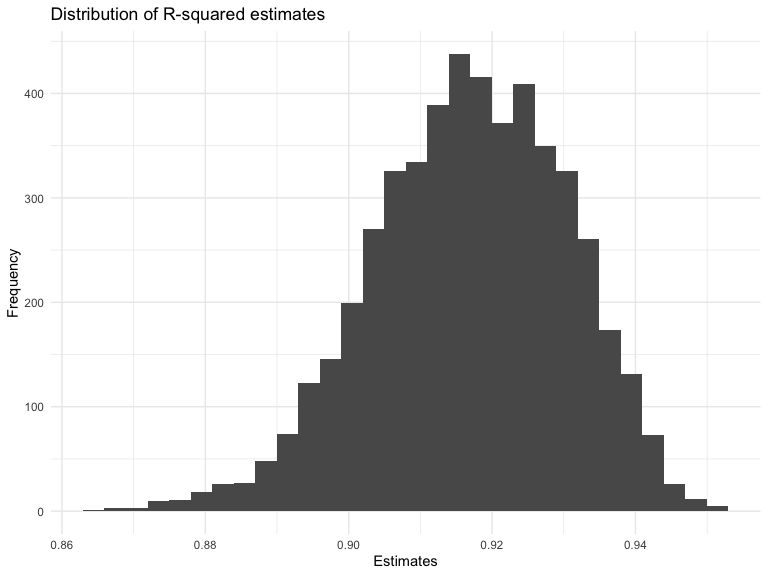
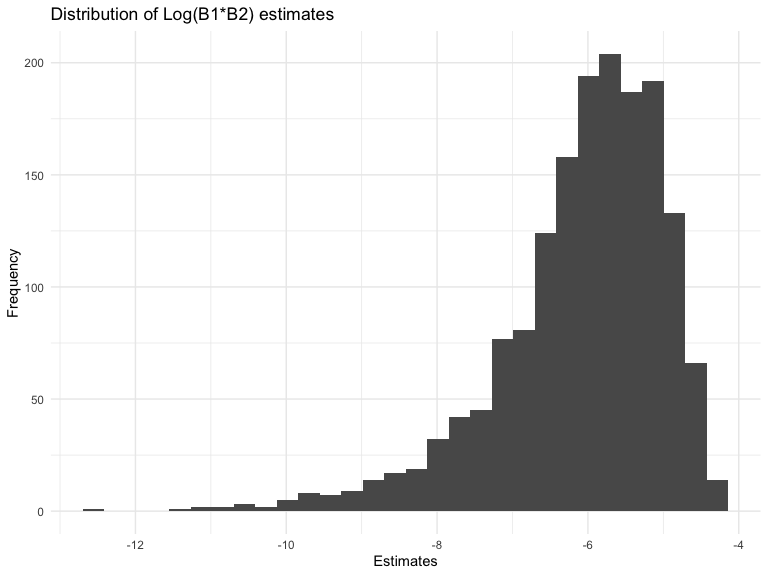

p8105_hw6_crd2162
================
Caleigh Dwyer
2023-11-28

### Problem 1: Homicide Data

In the data cleaning code below we create a `city_state` variable,
change `victim_age` to numeric, modifiy victim_race to have categories
white and non-white, with white as the reference category, and create a
`resolution` variable indicating whether the homicide is solved. Lastly,
we filtered out the following cities: Tulsa, AL; Dallas, TX; Phoenix,
AZ; and Kansas City, MO; and we retained only the variables
`city_state`, `resolution`, `victim_age`, `victim_sex`, and
`victim_race`.

``` r
homicide_df = 
  read_csv("data/homicide-data.csv", na = c("", "NA", "Unknown")) |> 
  mutate(
    city_state = str_c(city, state, sep = ", "),
    victim_age = as.numeric(victim_age),
    resolution = case_when(
      disposition == "Closed without arrest" ~ 0,
      disposition == "Open/No arrest"        ~ 0,
      disposition == "Closed by arrest"      ~ 1)
  ) |> 
  filter(victim_race %in% c("White", "Black")) |> 
  filter(!(city_state %in% c("Tulsa, AL", "Dallas, TX", "Phoenix, AZ", "Kansas City, MO"))) |> 
  select(city_state, resolution, victim_age, victim_sex, victim_race)
```

    ## Rows: 52179 Columns: 12
    ## ── Column specification ────────────────────────────────────────────────────────
    ## Delimiter: ","
    ## chr (8): uid, victim_last, victim_first, victim_race, victim_sex, city, stat...
    ## dbl (4): reported_date, victim_age, lat, lon
    ## 
    ## ℹ Use `spec()` to retrieve the full column specification for this data.
    ## ℹ Specify the column types or set `show_col_types = FALSE` to quiet this message.

Next we fit a logistic regression model using only data from Baltimore,
MD. We model `resolved` as the outcome and `victim_age`, `victim_sex`,
and `victim_race` as predictors. We save the output as `baltimore_glm`
so that we can apply `broom::tidy` to this object and obtain the
estimate and confidence interval of the adjusted odds ratio for solving
homicides comparing non-white victims to white victims.

``` r
baltimore_glm = 
  filter(homicide_df, city_state == "Baltimore, MD") |> 
  glm(resolution ~ victim_age + victim_sex + victim_race, family = binomial(), data = _)

baltimore_glm |> 
  broom::tidy() |> 
  mutate(
    OR = exp(estimate), 
    OR_CI_upper = exp(estimate + 1.96 * std.error),
    OR_CI_lower = exp(estimate - 1.96 * std.error)) |> 
  filter(term == "victim_sexMale") |> 
  select(OR, OR_CI_lower, OR_CI_upper) |>
  knitr::kable(digits = 3)
```

|    OR | OR_CI_lower | OR_CI_upper |
|------:|------------:|------------:|
| 0.426 |       0.325 |       0.558 |

Below, by incorporating `nest()`, `map()`, and `unnest()` into the
preceding Baltimore-specific code, we fit a model for each of the
cities, and extract the adjusted odds ratio (and CI) for solving
homicides comparing non-white victims to white victims. We show the
first 5 rows of the resulting dataframe of model results.

``` r
model_results = 
  homicide_df |> 
  nest(data = -city_state) |> 
  mutate(
    models = map(data, \(df) glm(resolution ~ victim_age + victim_sex + victim_race, 
                             family = binomial(), data = df)),
    tidy_models = map(models, broom::tidy)) |> 
  select(-models, -data) |> 
  unnest(cols = tidy_models) |> 
  mutate(
    OR = exp(estimate), 
    OR_CI_upper = exp(estimate + 1.96 * std.error),
    OR_CI_lower = exp(estimate - 1.96 * std.error)) |> 
  filter(term == "victim_sexMale") |> 
  select(city_state, OR, OR_CI_lower, OR_CI_upper)

model_results |>
  slice(1:5) |> 
  knitr::kable(digits = 3)
```

| city_state      |    OR | OR_CI_lower | OR_CI_upper |
|:----------------|------:|------------:|------------:|
| Albuquerque, NM | 1.767 |       0.831 |       3.761 |
| Atlanta, GA     | 1.000 |       0.684 |       1.463 |
| Baltimore, MD   | 0.426 |       0.325 |       0.558 |
| Baton Rouge, LA | 0.381 |       0.209 |       0.695 |
| Birmingham, AL  | 0.870 |       0.574 |       1.318 |

Below we generate a plot of the estimated ORs and CIs for each city,
ordered by magnitude of the OR from smallest to largest. From this plot
we see that most cities have odds ratios that are smaller than 1,
suggesting that crimes with male victims have smaller odds of resolution
compared to crimes with female victims after adjusting for victim age
and race. This disparity is strongest in New York. In roughly half of
these cities, confidence intervals are narrow and do not contain 1,
suggesting a significant difference in resolution rates by sex after
adjustment for victim age and race.

``` r
model_results |> 
  mutate(city_state = fct_reorder(city_state, OR)) |> 
  ggplot(aes(x = city_state, y = OR)) + 
  geom_point() + 
  geom_errorbar(aes(ymin = OR_CI_lower, ymax = OR_CI_upper)) + 
  theme(axis.text.x = element_text(angle = 90, hjust = 1))
```


## Problem 2: Weather Data

The following chunk imports weather data from NOAA

``` r
weather_df = 
  rnoaa::meteo_pull_monitors(
    c("USW00094728"),
    var = c("PRCP", "TMIN", "TMAX"), 
    date_min = "2022-01-01",
    date_max = "2022-12-31") |>
  mutate(
    name = recode(id, USW00094728 = "CentralPark_NY"),
    tmin = tmin / 10,
    tmax = tmax / 10) |>
  select(name, id, everything())
```

    ## using cached file: /Users/caleighdwyer/Library/Caches/org.R-project.R/R/rnoaa/noaa_ghcnd/USW00094728.dly

    ## date created (size, mb): 2023-09-28 10:20:17.291852 (8.524)

    ## file min/max dates: 1869-01-01 / 2023-09-30

Let’s create a linear model for maximum temperature (`tmax`) with
minimum temperature (`tmin`) and precipitation levels (`prcp`) as
predictors.

``` r
lm_weather =
  weather_df |> 
  lm(tmax ~ tmin + prcp, data = _)
```

Then, we’ll find the r squared and log(b1\*b2) for the weather model.
Note that because the coefficient for prcp is negative, the log of the
product of coefficients produces an NA. The log estimates are then
merged with the r.squared data.

``` r
lm_weather_rsq=
lm_weather |>
  broom::glance() |> 
  select(r.squared)

lm_weather_est=
  lm_weather |> 
  broom::tidy() |> 
  select(term, estimate) |> 
  filter(term != "(Intercept)") |> 
  summarize(log_coef = log(estimate[term == "tmin"] * estimate[term== "prcp"]))


weather_results=
bind_cols(lm_weather_rsq, lm_weather_est)
```

Now let’s create 5000 bootstrap samples. We’ll use map to write linear
models for each bootstrap sample and produce r-squared and coefficients
for each model. This produces a dataframe containing a dataframe for
each bootstrap sample, a dataframe of models for each sample, a
dataframe containing the r-squared, and a dataframe containing the
estimates. We’ll then unnest the estimate dataframe to calculate the log
of the product of coefficients for each model. We’ll then merge these
datasets.

``` r
bootstrap_results=
  weather_df |> 
  modelr::bootstrap(n = 5000) |> 
  mutate(
    models = map(strap, \(df) lm(tmax ~ tmin + prcp, data = df)),
    rsqr = map(models, broom::glance),
    est = map (models, broom::tidy)
  )
 
log_coef =
bootstrap_results |> 
 unnest(est) |> 
  summarize(log_coef = log(estimate[term == "tmin"] * estimate[term== "prcp"]))
  
bootstrap_df=
  bind_cols(bootstrap_results, log_coef) |> 
  unnest(rsqr) |> 
  select(strap, .id, models, r.squared, est, log_coef)
```

As mentioned, any model that includes a negative coefficient for prcp or
tmin will yield a “NaN” result when calculating the log of the product
of coefficients. The chunk below calculates how many bootstrap samples
produced NaN log estimates for this reason. Out of 5000 bootstrap
samples, an astonishing 3361 samples produced NaN log estimates.

``` r
bootstrap_df |> 
  filter(log_coef == "NaN") |> 
  count(log_coef)
```

    ## # A tibble: 1 × 2
    ##   log_coef     n
    ##      <dbl> <int>
    ## 1      NaN  3361

I will now plot the distribution of r squared estimates for the
bootstrap samples. The distribution of r squared estimates shows that
most estimates are centered around 0.92. The distribution is slightly
left skewed.

``` r
bootstrap_df |> 
  ggplot(aes(x = r.squared))+
  geom_histogram()+
  labs(
    title = "Distribution of R-squared estimates",
    x = "Estimates",
    y = "Frequency"
  )
```

    ## `stat_bin()` using `bins = 30`. Pick better value with `binwidth`.



Here is a distribution of the valid log estimates for the bootstrap
samples. The distribution of log estimates shows that most estimates are
centered around -6. The distribution of log estimates is left skewed as
well, with a greater skew than the r squared estimates.

``` r
bootstrap_df |> 
  filter(log_coef != "NaN") |> 
  ggplot(aes(x = log_coef))+
  geom_histogram()+
  labs(
    title = "Distribution of Log(B1*B2) estimates",
    x = "Estimates",
    y = "Frequency"
  )
```

    ## `stat_bin()` using `bins = 30`. Pick better value with `binwidth`.



Now we’ll find the confidence interval for each estimate using the
bootstrap samples:

``` r
CI_rsqr = 
  bootstrap_df |> 
  summarize(
    lower_bound = quantile(r.squared, 0.025),
    upper_bound = quantile(r.squared, 0.975)) |> 
  print()
```

    ## # A tibble: 1 × 2
    ##   lower_bound upper_bound
    ##         <dbl>       <dbl>
    ## 1       0.889       0.941

``` r
CI_logcoef =
  bootstrap_df |> 
  filter(log_coef != "NaN") |> 
  summarize(
    lower_bound = quantile(log_coef, 0.025),
    upper_bound = quantile(log_coef, 0.975)) |> 
  print()
```

    ## # A tibble: 1 × 2
    ##   lower_bound upper_bound
    ##         <dbl>       <dbl>
    ## 1       -8.98       -4.60
